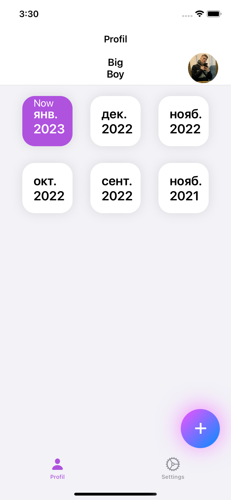
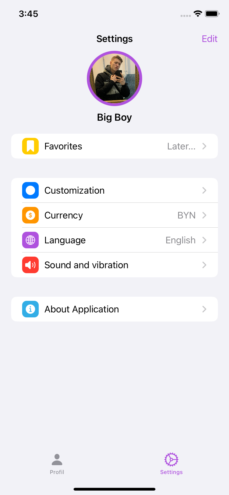
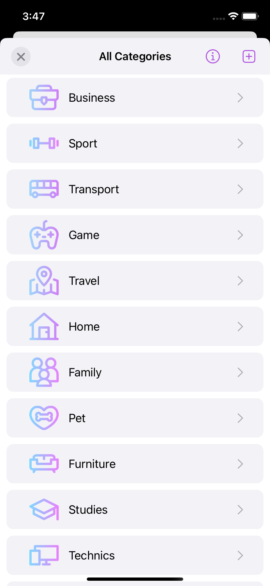
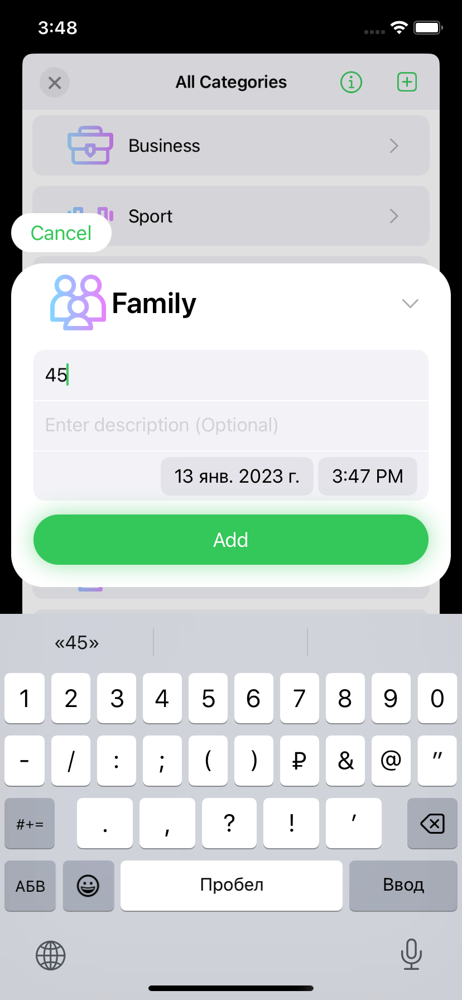
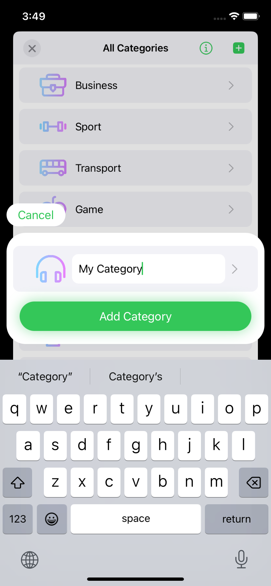
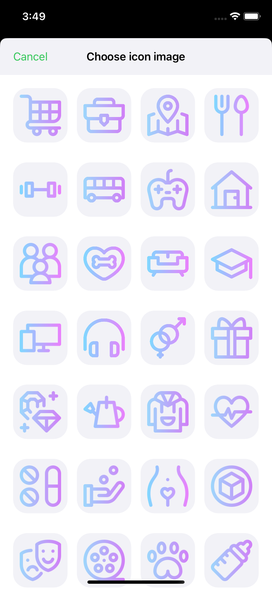
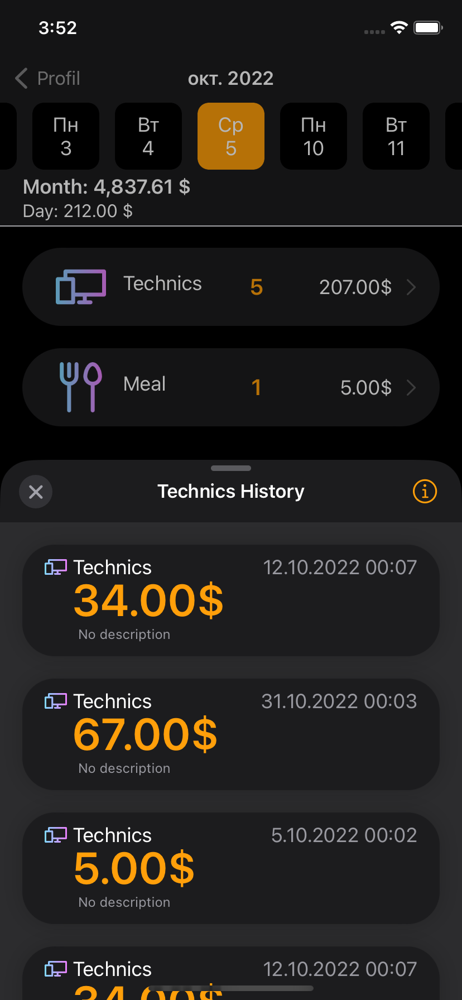
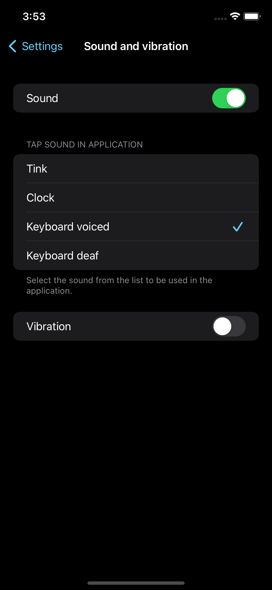

# ReccostApp
This is my first Swift iOS app
***
Description
>This app can help you keep track of your expenses.
>In app you can add your expenses to the list of all expenses and check your spending money per month whenever you want etc.
***
Software stack of knowledge
>Swift, UIKit, UserDefaults, AVFoundation(AVAudioPlayer), NSLayoutConstraint, UIView.animate etc.
***
Screenshots

***
